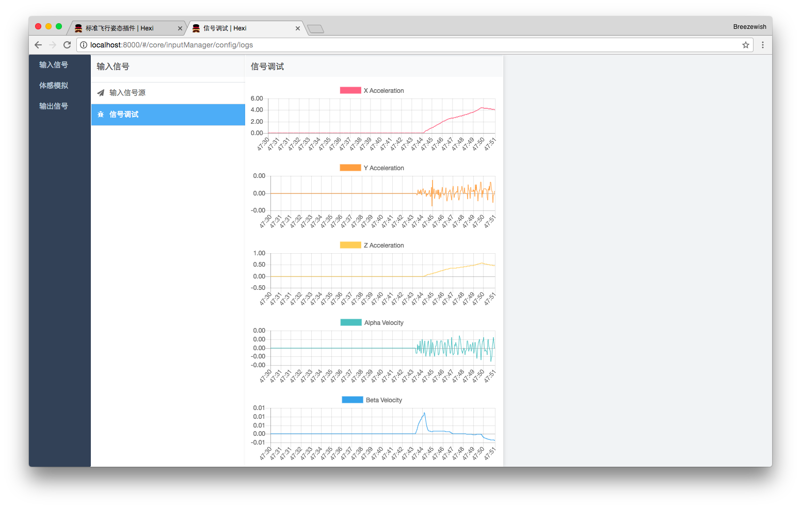
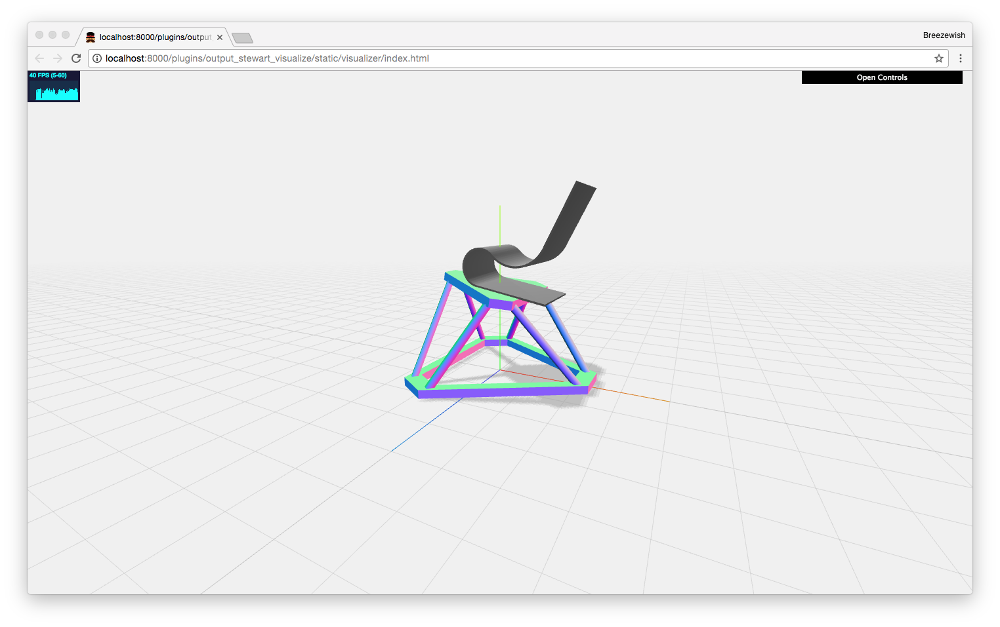

# hexi
Hexi is a generic motion simulator. Developed as my graduation project ([thesis PDF in Chinese](./resources/thesis.pdf)).

[Video demo on Youtube]([https://youtu.be/wAmHUI8TY4Q](https://youtu.be/wAmHUI8TY4Q))

## Features

- Generic: can meet demands by developing plugins.
- Supports Microsoft Flight Simulator X as an input signal source.
- Implements the classical washout algorithm.
- Supports visualizing simulation performance via a 3D Stewart GUI.

|  Screenshot: Realtime Signal Debugging   | Screenshot: Realtime Stewart Visualiation |
| :--------------------------------------: | :--------------------------------------: |
|  |  |

## !! Notice !!

There are no hardware supports due to my limited money & time during the research. However a real-time 3D visualization is available as described above.

Feel free to write output plugins to support a specific hardware and send me PRs!

## Alternatives & Comparison

Similar softwares are [X-Sim](http://www.x-sim.de/forum/portal.php) and [XSimulator](https://www.xsimulator.net/). However this project has the following advantages:

- Open-source & free of charge.
- Cross platform: Windows, Linux, MacOS.
- A greater plug-in system (more extensible).
- Using modern technologies.
- Possible better motion cueing performance (?).

## Possible Use of This Project

- Refer to the software implemention the classical washout algorithm, especially the HP/LP filters (in Python).
- Refer to the approach to connect to FSX (in .NET).
- Refer to the design and implementation of a extensible system (via plug-in mechanism).
- Refer to the implementation of rendering a 3D Stewart platform (via WebGL).
- Refer to the implementation of a TCP + UDP high performance async data channel (in Python).
- See how motion simulation really works!
- Design and test new motion cueing algorithms.
- Real-life motion simulation (if you can develop a hardware output plugin).

## Setup

```bash
python3 -m pip install -r requirements.txt
```

## Getting Started

```bash
python3 -m hexi.server
```


## Plugin Development

### User Interface

To build the user interface of your plugin:

```bash
npm run build:plugin -- --env.pluginName PLUGIN_NAME
```

Optionally, you can add additional option `--watch` to watch modifications.

## Core Development

To recompile the user interface of core modules:

```bash
npm run build:coreDll
npm run build:core # alternatively: npm run build:core -- --watch
```

